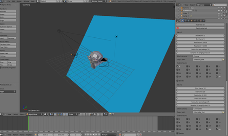

# Batch Rendering in Blender

Sssampo on #blenderaid on Freenode recently asked why Blender doesn't have a batch rendering tool like 3ds Max does. After giving him a few lines of Python that achieved this task I wondered the question myself: Why such an obvious tool doesn't exist?

So I created it myself.

[http://blenderartists.org/forum/showthread.php?281647-Setting-up-batch-render-tasks-(multiple-sequential-renders)](http://blenderartists.org/forum/showthread.php?281647-Setting-up-batch-render-tasks-(multiple-sequential-renders))

The tool is simple: You add sets (or batches) and give each of them some settings: What is the starting frame,  what is the ending frame, at what resolution is the set rendered, what camera and layers are used &c. Blender's UI programming is relatively easy, but there are a few things to learn. For one, I didn't figure out a good way to remove elements from a bpy.props.CollectionProperty since:

It's a bad idea to delete from a list while iterating it
You can't copy objects that are stored in bpy.context.scene easily (not even copy.deepcopy works)
So I made a few nasty hacks that  "work" well enough. I hope those don't come back haunting at me some time in future. I probably will add a few more things in script if people ask for them, but as far as I understand the script works already and makes the workflow easier. You no longer have to put 4000 frames rendering for half a day, then come visit your computer every hour to see if you can start rendering the next batch of frames.

The code is on [Github](https://github.com/Roisack/batch_render)

