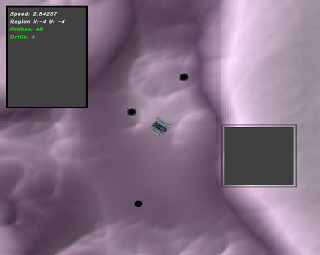

# 24 hours later

<datetag=2013-06-24>

I got home from my Midsummer festivities and woke up hungover. Apparently the fellows on our Finnish Blender community IRC channel had decided to host a game development contest with a 48 hour time limit. As I didn't have anything better to do, and a (as of now) a fiery flu was knocking on the door, I decided to join the fun challenge. There were no rules.

I spent 26 seconds planning the game and its engine, after which I had chosen the first thought appearing in my cortex: Water Miners of Trebulon, a game in which you fly a ship in a planet's athmosphere and find water deposits. Thanks for Blueskirt and RantingHuman for the names! A noble task. I figured it would be in the competition's spirit to do it all yourself instead of using, say, Unity. It's much more fun to look at the fruits of your labour 48 hours later and boldly say: "It's all mine."

The only shortcuts I took were SFML and a noise generator library called libnoise that I had checked out earlier when researching procedural noise algorithms. The engine was built very fast, sporting nothing but a simple content loading phase followed by a hard-coded event processor and entity update/render section. Then, I went on adding the noise library and generating noise with it. This was a quick task thanks to the excellent tutorials on the project's site. Afterwards, all I had to do was convert the libnoise images into SFML textures. My world was done!

I then noticed that generating a sizable area took a long time. I figured, unfortunately, that the best way to counter this is to simply multithread it: Libnoise is a coherent noise generator, meaning you can generate a small area, then move the bounds a bit and continue the noise in another computation, resulting in two seamlessly connecting images. I spent the rest of the day mostly working on this task, realizing it's somewhat hard to coordinate even a simple task like this with multithreading. The hacking made me feel slight guilt at being so extreme about Dwarf Fortress multithreading considering I had issues with 15 hours of code while Tarn Adams has over 10 years of code to multithread.

One of the problems I encountered was that my code spammed way too many threads: I simply executed a for loop, stepping the game's world by NOISE_SIZE, each time creating another thread that went on producing NOISE_SIZE^2 sized area of the world. As I had no limit on this I easily got a queue of a thousand threads. This caused an explosive expansion in memory usage up to the limit of 32-bit applications. A while later I had added a small segment of code that limited the concurrent threads to 8, keeping memory usage in sane limits.

At this point I had a somewhat playable game: The world was generating, albeit slowly, the player had a ship to fly around and the game ran smoothly. I added some quick loading banners and menus, instructions and playability tweaks. Then appeared the water deposits, randomly placed in the world, and soon after the deployable probes used for finding water and drilling stations for harvesting. About at this time the competition was about to end. As I began working on the game a day late I had made my entry in only 24 hours.

After uploading the binaries and working out a few Linux issues I published the game for others to try. Unfortunately quickly done meant badly tested, and very few got the game working due to non-compatible MS C++ redistributables or differing Glew versions. The noise library was also extremely slow (or more likely, my code was) and generating the world on single core machines took too long. The game's main mechanic wasn't properly implemented and the game world couldn't be expanded as the player flew about, resulting in the player eventually reaching a black void.

It was a fun experience. Since the rules were flexible and only one other entry was submitted I could have continued to work on this thing during Monday, but I wasn't honestly interested. The noise library was last updated 7 years ago (I had to use a Github fork that had replaced static Makefiles with CMake) and it wasn't really something you wanted to use for a real-time application. If I had had the time to study and design properly I would have gone for some GPU solution, maybe OpenCL generating the world on the fly.

