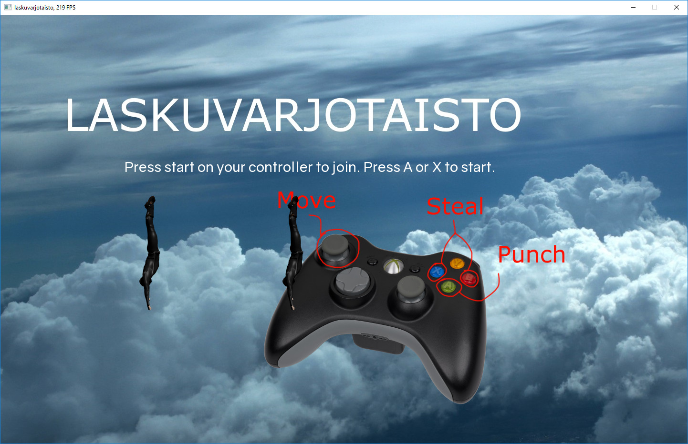

# Laskuvarjotaisto

<datetag=2018-07-28>

Once again, the Finnish Blender IRC channel had a gamejam around midsummer. An established tradition, I wrote my game hungover.

This time I had some time to plan my game in advance. The theme was simple: Creating a clone of an older Amiga game known as [Parachute Joust](http://www.lemonamiga.com/games/details.php?id=3052). In this game, two guys fall out of an airplane and fight it out for a single parachute. The guy who ends up with the parachute when the time runs out, wins. The mechanics were laughably simple and easy to implement with a strict time constraint of three days.

For the basic engine I copied an old template of mine I had lying around from several abandoned projects. This template included basic rendering, configuration options, controller support and data storage. After spending a couple of hours cleaning this code I had the basic structure in place. I moved on to implementing controls using the gamepads. I didn't have the time to write a proper controller configuration utility allowing custom deadzones or customizable keybindings, but these both could be done via a config file. Writing this code I couldn't help but to wonder how some games (I'm looking at you, Guilty Gear Xrd) manage to mess up their gamepad support so badly: With SFML all I had to do was write a generic gamepad button mapping matching certain input events in the game. How complicated can it be to properly support multiple controllers of different types? At the end of the project I ran a test game with two other guys, all of us having controllers of different types, and after some calibration the game ran fine. As an added bonus what was originally a bug turned into a feature: I never limited the number of controllers, having assumed the game was played by two players. However, since there was no limit, I gave the game a try with up to four controllers and nothing broke - technically there's no limit on how many players can join the fun!

The enjoyable part of a project well planned and limited in scope is how easily everything falls into place. With the basic controls down, all I had to do was get implementing the features I wanted: Punchable guys, a timer that runs out and stealable parachutes. All of these were fast to conjure up. I moved on to adding some audio, lavishly stealing open licensed sounds and music. I even had the time to spare to add some variety in the played sound effects to make them more interesting.

For animations I implemented a basic file format, the .chute, which contained only two bits of data: Animation playback speed and images to play in the animation. Some refactoring later I had a basic sprite class written supporting animations and looping them. Next would be the hardest part so far: replacing temporary programmer art with actual graphics, a task I had dreaded for and tried to avoid until the very end.

I first dared to try drawing the art myself. This quickly proved to take much longer than I had time for, and I instead jumped to take a shortcut. Soon I had [MakeHuman](http://www.makehuman.org/) running and a dashing protagonist "modelled". I sent this file to Blender and animated the character. Luckily there only were four different actions to do in the game, including movement in all directions in different states, which was doable even by an incompetentjumped to take a shortcutWell before the deadline the basic game was done. I only have a Windows build available, but I'm pretty sure the game compiles on Linux too.

* [Download](https://plantmonster.net/koodailut/laskuvarjotaisto_release.zip)
* Source: git clone [https://bitbucket.org/SirDifferential/laskuvarjotaisto.git](https://bitbucket.org/SirDifferential/laskuvarjotaisto.git)

Credits for external resources:

* Font: [https://www.dafont.com/gravity.font](https://www.dafont.com/gravity.font?l)
* Music from: [https://incompetech.com/music/royalty-free/music.html](https://incompetech.com/music/royalty-free/music.html)
* Sound effects from: [https://freesound.org/](https://freesound.org/)
    * [https://freesound.org/people/RSilveira_88/sounds/216196/](https://freesound.org/people/RSilveira_88/sounds/216196/) licensed CC RSilveira_880
    * [https://freesound.org/people/CastIronCarousel/sounds/216782/](https://freesound.org/people/CastIronCarousel/sounds/216782/) licensed CC CastIronCarousel
    * [https://freesound.org/people/Huminaatio/sounds/390462/](https://freesound.org/people/Huminaatio/sounds/390462/) licensed CC Zero Huminaatio
    * [https://freesound.org/people/nextmaking/sounds/86019/](https://freesound.org/people/nextmaking/sounds/86019/) licensed Sampling+ nextmaking
    * [https://freesound.org/people/rcroller/sounds/424144/](https://freesound.org/people/rcroller/sounds/424144/) licensed CC Zero rcroller
    * [https://freesound.org/people/deleted_user_6479820/sounds/353046/](https://freesound.org/people/deleted_user_6479820/sounds/353046/) CC Zero deleted_user_6479820
    * [https://freesound.org/people/deleted_user_6479820/sounds/353048/](https://freesound.org/people/deleted_user_6479820/sounds/353048/) CC Zero deleted_user_6479820
    * [https://freesound.org/people/AlineAudio/sounds/416838/](https://freesound.org/people/AlineAudio/sounds/416838/) CC Zero AlineAudio
    * [https://freesound.org/people/Dpoggioli/sounds/263541/](https://freesound.org/people/Dpoggioli/sounds/263541/) CC Attribution Dpoggioli
    * [https://freesound.org/people/FairhavenCollection/sounds/372899/](https://freesound.org/people/FairhavenCollection/sounds/372899/) CC Zero FairhavenCollection
    * [https://freesound.org/people/morganpurkis/sounds/398255/](https://freesound.org/people/morganpurkis/sounds/398255/) CC Zero morganpurkis
    * [https://freesound.org/people/timtube/sounds/61046/](https://freesound.org/people/timtube/sounds/61046/) CC NC timtube
* MakeHuman accessories
    * [http://www.makehumancommunity.org/clothes/motorcycle_jacket.html](http://www.makehumancommunity.org/clothes/motorcycle_jacket.html) licensed CC punkduck
    * [http://www.makehumancommunity.org/clothes/motorcycle_pants.html](http://www.makehumancommunity.org/clothes/motorcycle_pants.html) licensed CC punkduck
* Sky photos: [https://www.publicdomainpictures.net/en/view-image.php?image=50608&picture=clouds-above-the-sky-1@](https://www.publicdomainpictures.net/en/view-image.php?image=50608&picture=clouds-above-the-sky-1) CC0 Maliz Ong
* Xbox 360 controller photo [https://commons.wikimedia.org/wiki/File:Xbox-360-Controller-Black.png](https://commons.wikimedia.org/wiki/File:Xbox-360-Controller-Black.png)

