# Maths is fun! Interference with GLSL

<datetag=2013-02-01>

In this post I'll have a small tutorial on creating sort of a plasma-esque interference pattern in GLSL. I've been interested and in awe of the magic demosceners do in their art, and about two years ago I wanted to achieve that myself. I never managed to finish an intro myself, but I got a bunch of "oldschool" effects done. The one I'm most proud of is a simple interference pattern. To the more mathematically able of you this blog post probably won't offer much, but for someone as slow as myself it's important to explain everything in detail.

I'm not discussing how to create an OpenGL context and the shader pipeline. I'll simply be pointing out how waves can be used for this effect. This will be the final effect:

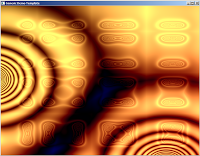
 
The Vertex shader does nothing fancy:

```
varying vec2 texcoord;
 
void main()
{
    vec4 fragmentPos = gl_ModelViewMatrix * gl_Vertex;
    texcoord = gl_MultiTexCoord0.st;
    gl_Position = gl_ProjectionMatrix * fragmentPos;
}
```

The fragment shader doodles graphics on a flat, square plane. Lights are ignored for now.

The waves are generated using a circular gradient. This is is calculated simply with the formula:

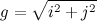
 
The fragment shader for this is

```
varying vec2 texcoord;
 
void main()
{
    float i = texcoord.s;
    float j = texcoord.t;
     
    vec4 color;
    color.r = sqrt(i*i + j*j);
    color.g = color.r;
    color.b = color.r;
     
    gl_FragColor = color;
}
```

This produces the following pattern:

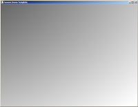
 
It's a circle alright, but it's located at the corner. Let's center it by giving the function positional parameters:

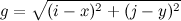
 
In the fragment shader, change the line

```
color.r = sqrt(i*i + j*j);
```

into

```
color.r = sqrt(( (i - 0.5)*(i - 0.5)) + ((j - 0.5)*(j - 0.5)));
```

In the 0.0 - 1.0 coordinate space the circle is now centered.

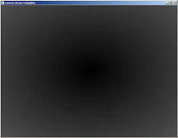
 
Now let's add some waves on the gradient. As we have so far simply been calculating the intensity of the circular gradient we can get waves by applying a sine function on this intensity:

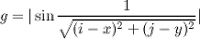

I reformatted the shader a bit to make it easier to read.

```
varying vec2 texcoord;
 
void main()
{
    float i = texcoord.s;
    float j = texcoord.t;
    float coordinate_x = 0.5;
    float coordinate_y = 0.5;
    float x_squared = (i - coordinate_x)*(i - coordinate_x);
    float y_squared = (j - coordinate_y)*(j - coordinate_y);
    float wave_ripple = abs(sin(1.0 / sqrt(x_squared + y_squared)));
     
    vec4 color;
    color.r = wave_ripple;
    color.g = color.r;
    color.b = color.r;
     
    gl_FragColor = color;
}
```

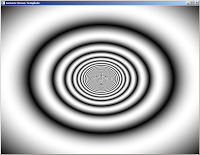
 
It's looking cyclic now. Time to add movement!

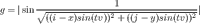
 
Parameters t and v are time and velocity: Time is given by the main program to the shader, and velocity is used to control the speed of the wave.

```
varying vec2 texcoord;
uniform float time;
 
void main()
{
    float i = texcoord.s;
    float j = texcoord.t;
    float coordinate_x = 0.5;
    float coordinate_y = 0.5;
    float velocity = 0.05;
    float x_squared_and_timed = ((i - coordinate_x) * sin(time*velocity))*((i - coordinate_x) * sin(time*velocity));
    float y_squared_and_timed = ((j - coordinate_y) * sin(time*velocity))*((j - coordinate_y) * sin(time*velocity));
     
    float wave_ripple = abs(sin(1.0 / sqrt(x_squared_and_timed + y_squared_and_timed)));
     
    vec4 color;
    color.r = wave_ripple;
    color.g = color.r;
    color.b = color.r;
     
    gl_FragColor = color;
}
```

The effect cannot be shown as a picture, but the wave now moves inside and out the picture.

Now let's consider what an interference is: It's the effect of two wavefronts colliding. This means something like this (pro photoshop skills):

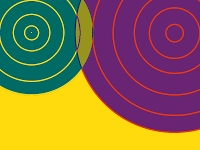
 
In the picture there are two waves: Wave 1 at top left, wave 2 at top right. At the middle we see the area in dark yellow showing the effect of interference. Thus, the next step is to move our original wave to the top left corner, and add another wave to the top right. I'm making the following mathematical definition now:

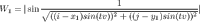

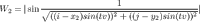

I have taken our original full formula and assigned it into two variables W1 and W2 (waves 1 and 2). The coordinate parameter is what defines where the wave will be located, and must be different for the two waves. Now comes the fun part: Let's add these waves together!

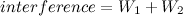
 
The shader begins to grow a lot now:

```
varying vec2 texcoord;
uniform float time;
 
void main()
{
    float i = texcoord.s;
    float j = texcoord.t;
    float coordinate_x_1 = 0.2;
    float coordinate_x_2 = 0.8;
    float coordinate_y_1 = 0.5;
    float coordinate_y_2 = 0.5;
    float velocity = 0.05;
    float x_squared_and_timed_1 = ((i - coordinate_x_1) * sin(time*velocity))*((i - coordinate_x_1) * sin(time*velocity));
    float y_squared_and_timed_1 = ((j - coordinate_y_1) * sin(time*velocity))*((j - coordinate_y_1) * sin(time*velocity));
 
    float x_squared_and_timed_2 = ((i - coordinate_x_2) * sin(time*velocity))*((i - coordinate_x_2) * sin(time*velocity));
    float y_squared_and_timed_2 = ((j - coordinate_y_2) * sin(time*velocity))*((j - coordinate_y_2) * sin(time*velocity));
     
    float wave_1 = abs(sin(1.0 / sqrt(x_squared_and_timed_1 + y_squared_and_timed_1)));
    float wave_2 = abs(sin(1.0 / sqrt(x_squared_and_timed_2 + y_squared_and_timed_2)));
     
    vec4 color;
    color.r = wave_1 + wave_2;
    color.g = color.r;
    color.b = color.r;
     
    gl_FragColor = color;
}
```

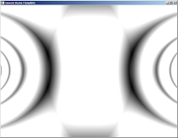
 
Lovely! However, it's kind of dull. The waves are simply oscillating left and right when we would like them zooming around, creating chaotic patterns in still beautiful fashion. Let's make the waves more around:

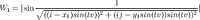

And the shader:

```
varying vec2 texcoord;
uniform float time;
 
void main()
{
    float i = texcoord.s;
    float j = texcoord.t;
    float velocity = 0.05;
    float coordinate_x_1 = 0.2;
    float coordinate_x_2 = 0.8;
    float coordinate_y_1 = 0.5 * sin(time * velocity);
    float coordinate_y_2 = 0.5;
     
    float x_squared_and_timed_1 = ((i - coordinate_x_1) * sin(time*velocity))*((i - coordinate_x_1) * sin(time*velocity));
    float y_squared_and_timed_1 = ((j - coordinate_y_1) * sin(time*velocity))*((j - coordinate_y_1) * sin(time*velocity));
 
    float x_squared_and_timed_2 = ((i - coordinate_x_2) * sin(time*velocity))*((i - coordinate_x_2) * sin(time*velocity));
    float y_squared_and_timed_2 = ((j - coordinate_y_2) * sin(time*velocity))*((j - coordinate_y_2) * sin(time*velocity));
     
    float wave_1 = abs(sin(1.0 / sqrt(x_squared_and_timed_1 + y_squared_and_timed_1)));
    float wave_2 = abs(sin(1.0 / sqrt(x_squared_and_timed_2 + y_squared_and_timed_2)));
     
    vec4 color;
    color.r = wave_1 + wave_2;
    color.g = color.r;
    color.b = color.r;
     
    gl_FragColor = color;
}
```

The effect:

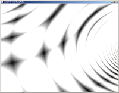
 

That's VERY different. As the waves are coming at different angles we are getting these cool cells in the pattern. It's something resembling a moire effect as well. Ok, let's get wilder: Both waves move, and we'll add more colours.


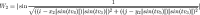 
 
We are using different times to make the movement seem less symmetrical. Note that all the sine functions are now turned into absolute values: Sine produces values from -1 to 0 half the times, and those offset our waves outside the 0.0 - 1.0 rectangle. By always keeping the values absolute the wave is always visible.

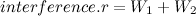
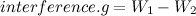
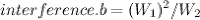
 
```
varying vec2 texcoord;
uniform float time;
 
void main()
{
    float i = texcoord.s;
    float j = texcoord.t;
    float velocity_1 = 0.05;
    float velocity_2 = 0.04;
    float velocity_3 = 0.05;
    float velocity_4 = 0.07;
    float velocity_5 = 0.1;
    float coordinate_x_1 = 0.2;
    float coordinate_x_2 = 0.8;
    float coordinate_y_1 = 0.5 * sin(time * velocity_3);
    float coordinate_y_2 = 0.5;
     
    float x_squared_and_timed_1 = ((i - coordinate_x_1*abs(sin(time*velocity_1))) * abs(sin(time*velocity_3)))*((i - coordinate_x_1*abs(sin(time*velocity_1))) * abs(sin(time*velocity_3)));
    float y_squared_and_timed_1 = ((j - coordinate_y_1*abs(sin(time*velocity_2))) * abs(sin(time*velocity_3)))*((j - coordinate_y_1*abs(sin(time*velocity_2))) * abs(sin(time*velocity_3)));
 
    float x_squared_and_timed_2 = ((i - coordinate_x_2*abs(sin(time*velocity_4))) * abs(sin(time*velocity_3)))*((i - coordinate_x_2*abs(sin(time*velocity_4))) * abs(sin(time*velocity_3)));
    float y_squared_and_timed_2 = ((j - coordinate_y_2*abs(sin(time*velocity_5))) * abs(sin(time*velocity_3)))*((j - coordinate_y_2*abs(sin(time*velocity_5))) * abs(sin(time*velocity_3)));
     
    float wave_1 = abs(sin(1.0 / sqrt(x_squared_and_timed_1 + y_squared_and_timed_1)));
    float wave_2 = abs(sin(1.0 / sqrt(x_squared_and_timed_2 + y_squared_and_timed_2)));
     
    vec4 color;
    color.r = wave_1 + wave_2;
    color.g = wave_1 - wave_2;
    color.b = wave_1*wave_1 / wave_2;
     
    gl_FragColor = color;
}
```

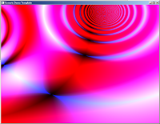
 
That's beginning to look like something. Can we do more? Yeah, but that's up to you. The idea is to mix these waves (there can be more than two, of course) and see what kind of effects are produced by introducing new operators. The first image in the header is produced by this monster:

```
varying vec2 texcoord;
uniform float time;
uniform int sizex;
uniform int sizey;
 
void main()
{
    float i = texcoord.s;
    float j = texcoord.t;
    vec4 color;
    color.r = (
     abs(sin(1 / sqrt( (i-0.5*abs(sin(time*0.01)))*(i-0.5*abs(sin(time*0.01))) + (j-0.5*abs(sin(time*0.03)))*(j-0.5*abs(sin(time*0.03))) ) + (time*0.1) ))-0.25
     +
     abs(sin(1 / sqrt( (i-0.75*abs(cos(time*0.01)))*(i-0.75*abs(cos(time*0.01))) + (j-0.75*abs(sin(time*0.03)))*(j-0.75*abs(sin(time*0.03))) ) + (time*0.1) ))-0.25
     *
     abs(sin(1 / sqrt( (i-0.75*abs(cos(time*0.01))*abs(sin(i*time*0.02)))*(i-0.75*abs(cos(time*0.01))*abs(sin(i*time*0.02))) + (j-0.75*abs(sin(time*0.03))*(abs(sin(time*j*0.02))))*(j-0.75*abs(sin(time*0.03))*abs(sin(time*j*0.02))) ) + (time*0.1) ))-0.25
      
    );
 color.g = (
     color.r
     -
     sqrt((i*i)+(j*j)) * sin(time*0.01)
    );
 color.b = (
     abs(sin(color.r * color.g)) * cos(time*0.02)
    );
    gl_FragColor = color;
}
```


 
I was mostly experimenting when I formulated this version. It's slower than the one written for this tutorial since I wasn't optimizing then. Also, this was made for a 4k intro. Have fun hacking!


