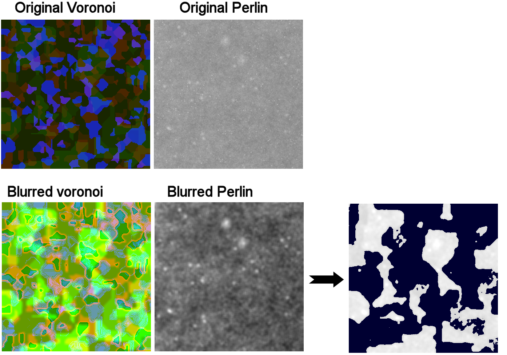
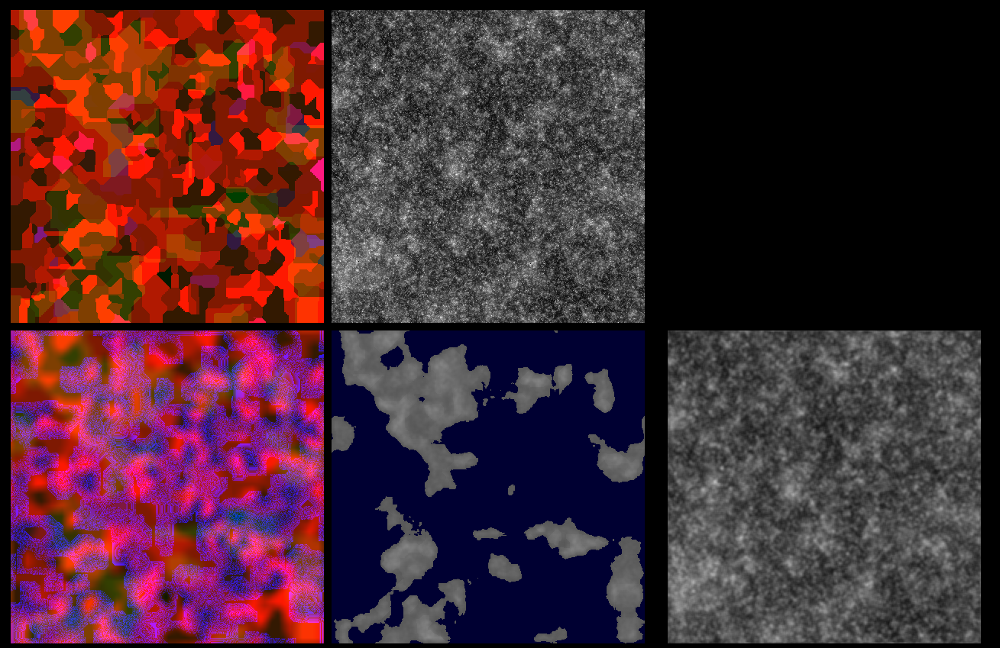
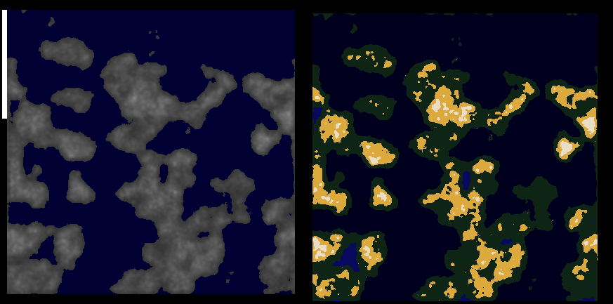
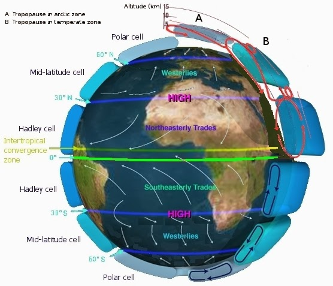
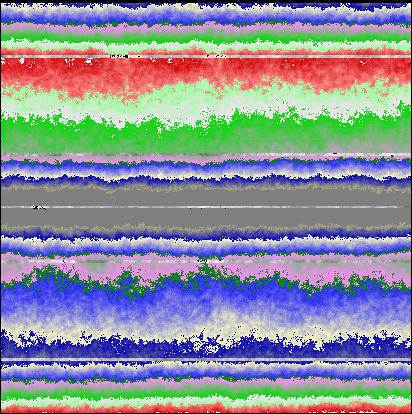
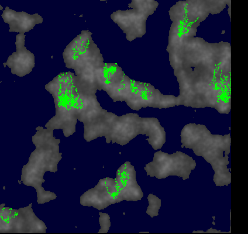
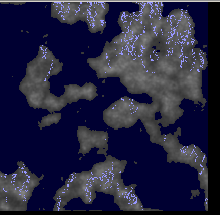
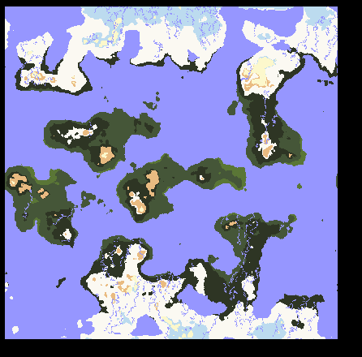

# Generation of Procedural Worlds using OpenCL

<datetag=2014-02-24>
To get it straight, I'm a fan of games that feature procedural content. When I play a game I expect it be a unique experience every time I enjoy it, and generally I want to play the same game multiple times. Dwarf Fortress is naturally the most divine of the current procedural games, with many other ASCII graphic games in tow.

There are many areas of procedurality, but the one that is mostly discussed is the actual geometry of the world. As Dwarf Fortress so well points out, the world's shape itself is only the canvas for the story. The most interesting part is the interaction of civilizations, the creatures that form those civiliations, and the monsters of the world. However, the world itself is the natural starting point in one's studies in procedural generation.

The production of random world is a very discussed topic and the algorithms utilized are very well known. As I have been studying this topic I've found many different ways of performing this task, but ultimately most of the methods resorted to noise functions or voronoi cells at their core. As I read about these generators which other people had created I couldn't help to notice that almost all of them were entirely on the CPU as single-threaded programs. I was currently studying OpenCL, so I figured I'd give generating a world on the GPU a try.

## Basics

The first question was multithreading the basic tools - voronoi cells, perlin noise and other graph / noise algorithms. With some searching I found a very efficient [Perlin generator](http://vimeo.com/29074357), but Voronoi diagrams remained somewhat complex to implement in parallel. As I didn't want to spend more time ramming my head at this problem I took the easy way and created a brute-force [Voronoi diagram generator](https://github.com/SirDifferential/proceduralis/blob/master/voronoi.cl) on the GPU. With 2000 data points this meant 2000^2 calculations for one diagram. Certainly this is completely impractical on the CPU, and stupidly inefficient even on the GPU. However, it worked in a few dozen milliseconds with OpenCL so I didn't spend time optimizing the algorithm.

To display the datasets I whacked up a basic SFML engine. The only thing it did was record key presses that updated the constants sent to the OpenCL kernel and displayed SFML sprites that were formed from the kernel generated data. Interestingly, the most expensive operation my program did at this point was forming the SFML sprites from the data that the OpenCL kernel sent back to the memory. I'm sure there would be a good way to somehow keep the SFML textures in OpenCL / GPU memory, but this seemed like inefficient use of coder time considering the program was still relatively fast.

## Geography generation

Now that I had the basic tools, Voronoi cells and Perlin noise, I had to somehow combine them. An article I found online used solely Voronoi cells by forming regions and then performed various operations on each region, then proceeding to form rivers and other elements. I copied some ideas from this and calculated two sets of Voronoi diagrams using OpenCL, recording the output to a 4-dimensional array (RGBA color channels). Each color channel had some feature of the world.

First channel: Large number of data points with 5 different values. Each value described height. This formed local areas of slight height difference.
Second channel: Small number of data points with 3 possible values. Values signified either ocean, low land or high land, thus forming continents
Third channel: Indices used to record the area of each pixel. This was made to remove a very lengthy calculation later-on when I was analyzing my world. The question that arose was "To which Voronoi cell does this pixel belong?" which I couldn't answer by color alone as I only had 5 different colors. The index was recorded as a unique identifier for each region.
Fourth channel: Same as above, but for super region indices.

In addition, I generated a perlin noise with some unorthodox constants. This produced some pretty rad looking shapes and was used as a random offset for the geometry.

Now I had the basic tools for generating the most apparent shape of my world. Combining these two maps was relatively simple: I took my continent color from the voronoi sprite and used the green color channel as height. I took this height and multiplied it by the perlin noise, interpolating to the range of [0.5, 1.25] thus forming a somewhat more random height. The result wasn't too impressive, but it was the basic shape. I chose some number to work as a limit for ocean level:


At this point I had some major issues with the level of randomness in my original data. It seemed like I was mostly getting either too large mega-continents or isolated blob islands. In addition, due to my Voronoi distance function my Voronoi cells were somewhat rectangular, forming nasty shapes. I solved this by writing an OpenCL blur kernel and, for both Voronoi cells and Perlin noise, performing a wide gaussian blur (10-20 pixels in radius). Then I combined the textures the same way:



At this point I had decent-enough continents, although I was hoping to improve the shapes in future. I decided that the core idea was there and could be easily changed by a different function in future. I moved on.

I had generated the smaller Voronoi cells and intended them to split the world to smaller regions. Due to my blur function I had two choices for using this data: In its original, rectangular form, or in the blurred smooth mess. After some benchmarks I went for the following function for describing the world height:

```
height(x,y) = blurred_voronoi_col(x,y).g * linearInterpolate(0.8, 2.10, perlin_noise(x,y)) * linearInterpolate(0.5, 1.2, smaller_voronoi_multiplier(x,y))
```

With the way I initiliazed my random data and generated the noise, I now could do a simple filter: Anything lower than the height of 0.17 is ocean. The result:



I was happy with the core shape of my world. However, there was one area I hoped to solve before moving on, and that was detecting regions: In Dwarf Fortres, when one hovers over the world map the game will tell in which area the cursor is currently in. This was fascinating to me and I wondered how such a task could be completed. After some searching I found the term "Connected Component Labeling" and spent a day reading academic papers on the topic. One of the most common methods of performing this "paint fill tool" (like it's in MS paint!) was by using a recursive neighbor search. This algorithm worked by first selecting the very first element and checking all the eight neighbors for this pixel. If the pixels shared some property (in this case, a height of a defined range), the pixels were part of the same region. If the pixels were part of the region, then, recursively, the algorithm marked the neighboring pixels as the "current pixel". This algorithm worked well in theory, but failed in practise. The problem was that I had areas that were millions of pixels in size and no programming language allowed that deep recursion trees. I was forced to search something else.

Stackoverflow.com had a suggestion for a similar problem. This idea involved replacing the recursive search by a stack structure: Instead of performing a recursive function call, all the "matching neighbor pixels" were added to a stack of pixels that needed to be checked. When the stack was empty, the region search was finished. This method was perfect and completed the search in a relatively fast time. I'm sure it's possible to improve the speed, but it's I doubt great improvement can be gained with easy solutions. Unfortunately, I could not figure out a way to perform the Connected Component Labeling using OpenCL - the problem might be single-threaded in its nature.

Using the region labeling I assigned all my pixels to some region and classified specific types of regions to a specific range of codes. All oceans (water pixels that covered a region greater than a set amount) had an identification number less than 5000, all hills were labeled from 5000 to 10000, mountains had 10000 to 20000, and the rest was reserved for flat regions.



The algorithm [in my source](https://github.com/SirDifferential/proceduralis/blob/master/source/worldGenerator.cpp#L158).

The reason I had performed this task was to make it easy to solve the next area in my procedural world's life cycle. That being...

## Climate generation

By reading a million articles online I had understood that rivers and erosion were among the most difficult parts in generating a realistic world. After going through the  explanation of Dwarf Fortress world generation I decided to go for something similar, and wanted to simulate rain shadows and produce rivers by first simulating rainfall. This turned out to be an extremely difficult problem. How would you simulate something as complex as climate?

More reading of academic papers followed. With mostly nothing practical gained I moved on to reading articles and blogs written by others who had tackled this problem. One such person was Ebyan Alvarez-Buylla at [nolithius.com](http://www.dungeonleague.com/2010/03/28/wind-direction/). He had an interesting idea: Generate climate zones by using our planet's wind circulation:



Choose arbitrary wind directions for each of the areas, and use linear interpolation to smooth the areas between the "wind borders". This produced large wind currents on the world that could be used for simulating cloud movement. He also suggested distorting this smoothed out wind map by using fractal brownian motion to form kind of jet trails, and I copied this idea as well.


The basic idea: Colors signify directions. Dark green is south, bright red is east, dark red is north, dark blue is west.



Distorting the map using perlin noise to produce jagged outlines.


Near complete version. The yellow lines are a few chosen simulation points that I asked my program to solve. The points were placed at arbitrary locations, and continued to follow the winds for 1000 steps. The implementation [in OpenCL](https://github.com/SirDifferential/proceduralis/blob/master/winddirection.cl).

With the wind map generated the next step was easy. All I had to do was write an algorithm that calculated rainfall for point (x,y) by "flying upwind". The algorithm had to pay attention to the general distance it took to hit ocean (the source of rainfall), and record any hills and mountains met (rain shadow sources). I also ran my wind direction map through the blur kernel to smooth some artifacts out.


## Rivers

As the precipitation, and thus rainfall, was generated rivers seemed trivial. I didn't expect quite as many complications as I ended up having. Turns out that the dynamics of falling water can get extremely hairy. I simplified and simplified the problem until I arrived at a decent result.

The algorithm worked as follows: Find all those points that are high enough with necessary rainfall. For all these points, assign a new river ID. Check all neighboring pixels in the heightmap and advance down. If there is no path down, pick the path with minimum ascent. In addition, the algorithm was at times allowed to carve through higher neighbors.

Some of the earlier tries with this method were a bit ugly:



The habit of certain areas producing a lot of rivers caused entire mountain ranges to appear as nothing but one river. To limit this I added a random check which had to be passed for a river to form, and prevented the creation of rivers if one already existed at that location. This alone didn't solve the problem, so I made a relatively simple tweak: If one neighboring pixel is a river, merge these rivers and contiune the search for only one of the rivers.

The outcome was better, but future work must be done to improve the lowlands:



The issue with lowlands here is that large regions without mountains do not form rivers at all. To solve this, in future I will have to add some kind of special lowland-river-routine that works separately. I implemented the river code on the CPU. There might be a way to do the rivers in parallel, but it needs some further thinking. [My implementation](https://github.com/SirDifferential/proceduralis/blob/master/source/worldGenerator.cpp#L680).

## Temperature

By calculating the distance from the meridian and offsetting it a tiny bit by some select trigonometric functions I achieved the following temperature field:


I did not really spend much time on this - it seemed unnecessary. Planetary temperatures are pretty straightforward and based mostly on latitude. Of course, oceanic currents are relevant: Europe would be a lot colder if it wasn't for the Gulf Stream. However, these thoughts were unimportant as of now.

## Biomes

With all the data computed earlier in the program biomes were almost trivial - all that was needed was a simple OpenCL program that checked the various values for each pixel and deduced the biome type from this. In my case, I first lowered temperature based on height (high mountains are cold) and marked the mountain regions with their own colors. Then I moved to considering the balance of precipitation and temperature and formed areas from arctic to tropical rainforest.



There was still some cleaning to do with the biome coloring. Some areas of the world were still too prevalent and the constants used for generating the precipitation and windzones may have to be fine-tuned. However, the basic idea was there.

Next in my journey I will begin smoothing out the biome borders, tweaking the rivers and actually using the world for something. Be seeing you, and happy hacking!

