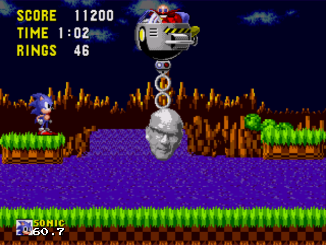
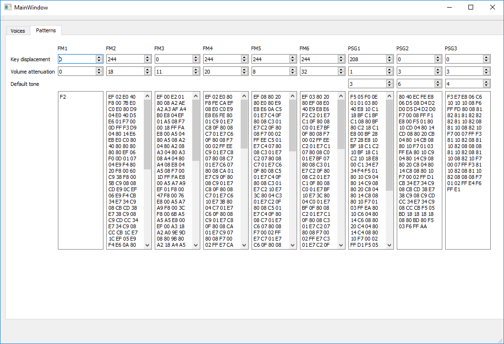

# Sonic 1 bachelor party romhack

<datetag=2019-05-26>

A friend of ours, an avid Sonic fan, is getting married and it was our sacred duty to throw him a bachelor party. But what should we do there? Well, the man of the hour had lamented he didn't have time to do an invitation intro for the wedding and, as such, we decided to do just that. After some thinking we figured the stylish way to do it would be via a Sonic romhack.

None of us in the pts demogroup had done a romhack earlier. Some thinking and beers later we guessed that the Sonic fan community is probably autistic enough that they've already reverse engineered all the games, and maybe with Sonic 1 the developers hadn't yet pushed the hardware to its absolute extremes, perhaps making it easier to work with the game's ROM. Thus, Sonic 1 was chosen.

The fans were more devoted than we expected: In addition to wikis of useful guides, they had produced a well-documented Sonic 1 disassembly with an easy toolchain, assuming you don't mind running random Windows executables downloaded from the internet. Working with this disassembly was extremely easy and fast, and shoutouts should go to everyone who worked on this thing. You saved us a lot of time. We found only one malware, too!

Our plan for the romhack was simple: Make the game seem normal at first, then with increasing quantities add stuff that's out of place, making the player suspect something is wrong. Eventually the plan became to simply having two levels followed by the invitation intro and some custom music. We decided on a date and got cracking.

One of the first features we wanted to implement was to make spikes deal damage on the sides as well. Unfortunately we didn't leave the initial version of this feature in the final ROM, which involved the spikes dealing damage the moment they appeared on the screen. Other stuff we added involved a custom boss movement pattern and a new ball sprite. We were baffled for a moment when Kekkonen decided to start spawning inside the rock sprites in the levels. This took some digging to get fixed. Turns out you can't just start adding extra bytes in the sprites without modifying the start addresses / offsets for other sprites.

The music hacking turned out to be rather intense. Sonic 1 uses a sound playback system which romhackers have labeled as "SMPS", and trying to export music into this format wasn't simple. Ultimately we decided to create a tool for working with the music format to more easily edit the instruments and the pattern data. The initial goal was importing one of the game songs into the tool, then exporting it back with the intention of having one-to-one match in the binary file outputted by our tool. The first results [weren't flawless](https://plantmonster.net/pts/sonic1_romhack/seegaa.mp4).

But eventually we had it all figured out, and we're now making it public for anyone to use. It's available here under the MIT license: [https://github.com/pts-demos/s1_music_gen](https://github.com/pts-demos/s1_music_gen)

Next up, our big question was the actual invtro portion of the romhack. How could we do intro style effects inside a Sonic game? Do we start writing our own custom assembly into the sources and try to work with what's in the game? No, we compile a second binary using SGDK, add the compiled binary as incbin, then execute a jmp instruction to move the execution into the other binary. What could possibly go wrong?

The system owb created for this works as follows:

* CompIle the intro so it begins at address $90000, with empty space in binary before this address. $90000 is a large enough address that the entire Sonic 1 ROM fits under this address
* Remove the empty space. The ROM start address is now $90000 with zero bytes before this.
* Use incbin to add the binary into a label in the Sonic 1 ROM, aligned to address $90000
* Jump into this label to start the demo
    * This was done by making one of the monitors trigger an error, and then the game's error handler displays an error message on the screen, plays the Sega sound and executes a jmp. Because why not.
* Ignore the fact that this only works on two emulators. Pray it works on real hardware
* Move on with your life knowing you have just done this

The demo itself was planned to have a couple of effects with a scroller, nothing fancy. We reused the code from our earlier Sega demo, [PTSD](http://www.pouet.net/prod.php?which=76304), and stripped away the parts we didn't need. We added a real quick rehash of an effect from the original demo, then resized it to keep FPS at solid 60. By this point we had pretty much lost motivation for working on the project and called it done. As is only appropriate, the "final" state of the demo only ran successfully if compiled with an older version of SGDK, but since it ran properly on the hardware we couldn't bother fixing it.

The party itself went well, even though both the party champ and myself were sick on the day with a cold and sinus infections. Some beer was had and the romhack portion worked without issues. [Sugoi Arcade](http://www.sugoi.fi), where we handled the romhack portion of the party, was an amazing place and the proprietor seemed like a pretty chill dude. If you're looking for an arcade experience in Helsinki and don't mind some commuting, then I can absolutely recommend this place: They had driving games, light gun shooters, fighting games, multimachine multiplayer games, rhythm games with custom instruments, and others. There also was a tarp in the shape of a flipper table in the rear, so maybe that will be playable at some point?

[Download](https://github.com/pts-demos/s1disasm/releases/download/1.0/sonicus1.bin) the ROM. The binary can be executed like any other Megadrive ROM in most emulators, or if you want, on real hardware. Here's the [source code](https://github.com/pts-demos/s1disasm).

Credits:

* Everyone in Sonic romhacking community who had already done all the hard work
* Gekko: code, graphics, levels, music, overwriting VRAM
* lotheac: code, graphics, levels, hardware, not overwriting VRAM
* owb: code, figuring out the hack to jump into the demo
* Markus @ Sugoi Arcade, getting us that 60~ kg CRT television

