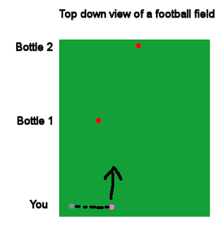
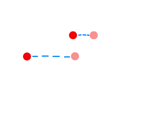

# Parallax Scrolling with SFML

Shadow of the Beast, a side-scrolling platformer released in 1989 for Amiga and later for other systems, has always had a special place in my heart. It could be described as a "spare no expenses" product considering that wherever one examines the game it features something truly revolutionary. In addition to the fantastic audio work by David Whittaker and the high quality artwork it also introduced something never seen in a game before - 12 levels of parallax scrolling.

Consider this: You want to achieve the illusion of distance, of 3D, without introducing a third dimension in the engine. How would you proceed? Parallax is a phenomenon, for one, relevant in astronomy (another of my great loves). It describes change of position of an object in relation to other objects at different distances. If this mouthful felt hard to absorb let's think of an example:

Imagine you are standing at one end of a football field (European football you yankees). Place a bottle of quality ale half way to the other end of the field, and another bottle at the very opposite end. Now, walk to the left side at your end and take a photo facing the two bottles. Next, walk some distance right and take one more shot. If you now look at these photos you can see that the APPARENT position of the bottles has changed a different amount: The bottle that is closer to you seems to move more in regards to the screen area. This is called parallax.






Parallax is used in astronomy for figuring out how far and how large stars are. This is a genius system: First you wait for Earth to be precisely at its left peak in regards to the target star, take a picture, then take pictures for a duration of 6 months until the Earth completes half a circle, arriving at the opposite end of its orbit around the Sun. In these pictures the stars move different distances and their properties can be calculated.

This can be applied in 2D graphics to achieve an illusion of distance by having layers of background and foreground images that move with the main camera, but contain a coefficient that slows or increases their movement. If you are doing a game in OpenGL you can achieve this by some kind of matrice calculations but I haven't really gone that way. With SFML there is already a good system for this: Views.

To implement parallax we'll assume we have the following system:

* The game has one main renderWindow which displays all the graphics.
* There is a `std::vector<std::pair<float, sf::Sprite*>>` for both background and foreground images
* Graphics are rendered as follows:
    1) Render backgrounds
    2) Render standard graphics
    3) Render foreground
  
So now that we assume that parallax can be achieved by slowing down the background images how would the code look? It's simple:

```
for (auto iter = backgrounds.begin(); iter != backgrounds.end(); iter++)
{
    sf::Vector2f currentTarget = getCenterTarget().getCenter();
    float parallax = iter->first;
    sf::Sprite* bg = iter->second;
    sf::View v;
    v.setCenter(parallax * currentTarget);
    game.getMainWindow()->setView(v);
    game.getMainWindow()->draw(*(bg));
}
game.setView(getCenterTarget());
game.draw(everythingElse());
anotherLoopForForeGround();
```

This is a snippet directly from my game. In my level system each level keeps track of a position where the screen must focus (the player's location). This can be found by calling getCenterTarget().getCenter(), resulting in a sf::Vector2f describing (x,y) coordinates.

Next, we take the parallax coefficient from the vector of backgrounds. The vector is built like so:

```
std::pair<float, sf::Sprite*> temp_bg;
temp_bg.first = 0.8f;
temp_bf.second = game.getDataStorage()->getSprite("somebackground");
backgrounds.push_back(temp_bg);
```

The parallax coefficient of 0.8f means that as the main View moves an unit u, the background moves u*0.8f.

We are not moving the background image itself (which is one, more complex way to do this). Instead, all the backgrounds are assigned a temporary View which is first assigned to the real, standard view (where the player is) and this view is then moved, as if the camera was moved a bit to the side.

The result? I think it's pretty good:


