# Maths is even more fun: Perlin Noise with GLSL

In the last post I discussed implementing an interference pattern using GLSL. Today I'll be exploring the very commonly used Perlin Noise which has all kinds of fancy applications especially in procedural landscape generation. Once again, my blog will be explaining the functionality of the noise instead of writing a highly optimized and fast version of it. I've learned most of this stuff from other websites, but none of them really explained why anything happened in clear words. When you consider implementing a noise yourself, consider two things: 1) Use Simplex Noise instead 2) Find an optimized version that you can use instead. This algorithm must be extremely fast especially for dynamic procedural terrain generation in real time. All of this talk will be in two dimensions since that's easier.

Once again, in this tutorial I shall be discussing only the ideas behind perlin noise and implementing the effect in a fragment shader. This post does not address the implementation of any OpenGL / GLSL pipelines. We are again doodling the effect on a rectangle, and use the OpenGL texture space of 0.0 - 1.0. No lights or vertex maths are considered. We have a texture of size 1024x1024 available, and we are doing conversions between [0...1024] and [0...1] space a few times.

## What Perlin Noise is?
Assume that you wish to generate shapes of some size that still appear random, sort of random blobs instead of random pixels. A pure random noise generator would simply produce individual pixels that form noise, so that alone won't do. Instead, one way to go about this is to generate gradients of some length for each pixel. I recommend downloading Blender and playing with its procedural textures, especially the "clouds" texture which is implemented using some form of Perlin or Simplex noise.

## How it is done?

As said above, gradients. Assume that our rectangle forms a grid. For every grid coordinate calculate a random number. The grid forms cells that lie between 4 grid coordinates. For each fragment within a cell, calculate a gradient by using dot product from the cell fragment to the cell's 4 grid coordinates. To keep things simple, we'll work our way there in steps and do this a bit differently. First, we need some random data. This could probably be done in a shader somehow, but I find it easier to pre-generate a map of random values, and then send that to the fragment shader.

## Before we begin:

1. Generate a texture of size 1024x1024 and for each its pixel assign a random value. I'm using values between 0...255.

2. Send this texture to the fragment shader

3. Use a sampler2D for reading the random values

At the top of my fragment shader I add these uniforms:

```
varying vec2 texCoord;
uniform sampler2D baseNoise;
```

To read data from this texture I use the following:

```
float value = texture2D(baseNoise, texCoord.st);
```

Using this for all RGB channels I get the following effect:

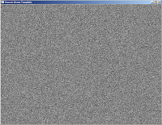

## First step: Cell noise

Perlin noise is based heavily on this entire concept of cells within a grid, so let's begin by creating some cells. Cells are produced by calculating a coordinate (x1,y1), then calculating another coordinate (x2,y2) that is offset by some length in relation to the previous coordinate. This length shall be called unit_length in this tutorial, and defines how large cells we are using. For the purposes of some arithmetic we are converting into integer coordinate system [0...1024] from the standard float coordinates of [0...1.0].

Firstly, we do the conversion:

```
float noise2()
{
    float final_noise = 0.0f;
    float i = texCoord.s;   // fragment x position in coordinate space 0...1
    float j = texCoord.t;   // fragment y position in coordinate space 0...1
    
    int scale_x = 1024;
    int scale_y = 1024;
    
    int i_resized = i*scale_x; // fragment x position in coordinate space 0...1024
    int j_resized = j*scale_y; // fragment y position in coordinate space 0...1024
     
    int unit_length = scale_x/50;
    ...
}
```

And also define the main function:

```
void main()
{
    vec4 col;
    col.r = noise2();
    col.g = col.r;
    col.b = col.r;
    gl_FragColor = col;
}
```

In this newly found 1024 coordinate space we now have to calculate regions of the texture that shall be coloured with a single colour. To do this we are doing an arithmetic trick:

```
int coord_x1 = (i_resized / unit_length) * unit_length;
int coord_x2 = coord_x1 + unit_length;
int coord_y1 = (j_resized / unit_length) * unit_length;
int coord_y2 = coord_y1 + unit_length;
```

The maths here appears a bit strange. coord_x1 is computed using a floor function which is automatically used for integer division. Consider that we have the fragment at (0.34, 0.75). Let's see what happens:

```
int i_resized = i*scale_x;
// 0.34 * 1024 = 348.16 = 348
int j_resized = j*scale_y;
// 0.75 = 768
 
int unit_length = scale_x/50;
// 1024 / 50 = 20.48 = 20
  
int coord_x1 = (i_resized / unit_length) * unit_length;
// 348 / 20 = 17.4 = 17
// 17 * 20 = 340
  
int coord_x2 = coord_x1 + unit_length;
// 340 + 20 = 360
 
int coord_y1 = (j_resized / unit_length) * unit_length;
// 768 / 20 = 38.4 = 38
// 38 * 20 = 760
 
int coord_y2 = coord_y1 + unit_length;
// 760 + 20 = 780
```

We have now calculated a downsampled region on this texture: a cell. We know that the area formed by points (340, 760) and (360, 780) will be coloured with a single colour. Since this is done for every cell on our texture, this produces a cell noise. Let's take some random data using our sampler:

```
final_noise = texture2D(baseNoise, vec2(coord_x2/1024.0f, coord_y2/1024.0f)).r;
```

We have to convert back to the [0...1] coordinate space in order to fetch the pixel data from our random map. The effect:

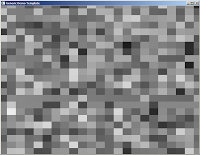

## Linear interpolation explained

What we previously did was form an "imaginary" grid of random values. What we are now doing is calculating gradients for each fragment within the cells. This is done using linear interpolation, which is about the most important mathematical tool you will need in programming and game development.

```
float interpolate(float x0, float x1, float alpha)
{
    return (x0 * (1.0 - alpha) + alpha * x1);
}
```

This function is fairly simple. You give it two values x0 and x1. These two points represent some magnitudes - in our case the intensity of our two chosen noise points - and form a linear line between them. Then you give the function an alpha between 0 and 1. This alpha represents the position we are at in relation to the two points x0 and x1. Alpha of 0 would mean we are at the left end of the line, at the coordinate x0, and alpha of 1.0 would mean we are at the right end at coordinate x1. Alpha of 0.5 would mean we are in the middle. Using this chosen point alpha we then check where on this line we landed and record the value.

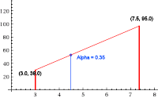

In this example picture alpha was chosen at point 0.35, so a bit left from the middle point.

## Second step: Gradient cell noise

Now that we have a grid of cells with random colours we can begin calculating gradients for them. Let's first focus on calculating only one set of gradients: The values that form between a cell's top left node and its top right node. We have already computed these points: coord_x1 and coord_x2. Looking at our original random noise picture above we can see that if we take these two coordinate points we will land on some random value. These are the magnitudes used in our linear interpolation.

We now need to calculate the alpha. As you may have already figured, it's simply the distance a fragment lies from the top left and top right nodes of a cell as a value in [0...1.0]. If we are at middle, the value is 0.5.

```
float unit_alpha = 1.0f / unit_length;
float horizontal_blend = (i_resized - coord_x1) * unit_alpha;
```

Ok, we have our magnitudes and alpha. Let's linear interpolate!

```
float coord_x1_resized = coord_x1/1024.0f;
float coord_x2_resized = coord_x2/1024.0f;
float coord_y1_resized = coord_y1/1024.0f;
float coord_y2_resized = coord_y2/1024.0f;
 
// Take the values of our original random noise texture at point (x1,y1),
// Take the values of our original random noise texture at point (x2,y2)
// Then using our fragment position in relation to these points,
// perform a linear interpolation for the values
float top = interpolate(texture2D(baseNoise, vec2(coord_x1_resized, coord_y1_resized)).r, texture2D(baseNoise, vec2(coord_x2_resized, coord_y1_resized)).r, horizontal_blend);
```

Note that I first had to convert my coordinate space back into the [0...1] range since we are sampling the texture given to the fragment shader by the main program. So, what does this look like?

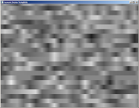

It's looking like a cell noise, but begins to have some Perlinish appearance. Next we have to calculate a similar gradient, but for the bottom nodes of each cell:

```
float bottom = interpolate(texture2D(baseNoise, vec2(coord_x1_resized, coord_y2_resized)).r, texture2D(baseNoise, vec2(coord_x2_resized, coord_y2_resized)).r, horizontal_blend);
```

This produces a similar picture, but for the lower nodes:

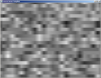

Only one step left to do: We combine these two sets of gradients. How? Why, by linear interpolation of course!

```
float vertical_blend = (j_resized - coord_y1) * unit_alpha;
final_noise = interpolate(top, bottom, vertical_blend);
```

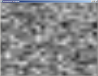

We have calculated our first Perlin Noise! However, it's looking kind of... bad. This is where we can begin doing anything we want with the noise, but a common way to improve it is by using *drums* fractals.

## Fractal Perlin Noise

This is actually quite simple. What we did in our above example was calculate a Perlin Noise using a fixed unit length, in this example done by splitting our coordinate space in 50 gradients (or cells). This produces an acceptable noise. Let's see what happens if we change the unit length:

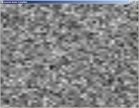

```
int unit_length = scale_x/10;
```

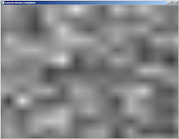


```
int unit_length = scale_x/30;
```

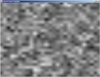

```
int unit_length = scale_x/60;
```

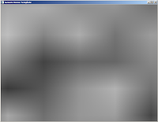

```
int unit_length = scale_x/100;
```

The results indicate that the smaller the gradients are, the more detail there is in the produced noise. What would happen if we combined these noises?

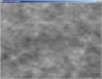


We are getting there. This is a concept very close fractal functions: We are doing the same operation again and again for smaller regions, getting tinier and tinier details at every iteration. Then, using some kind of logic, we combine all these layers together and form the final noise. However, this is not very effective: Perlin Noise, as it stands, has the complexity of O(n^2) as it is, and we just increased our computation by four times. When you are implementing this type of noise you are better of googling for some algorithm that people more intelligent than myself have optimized to do this fractal part in just a single, complex line. However, let's see what we can do by doing this the slow way.

We set up a bunch of arrays that contain perlin noise values for different iterations of our fractal function. I've included my final program:

```
uniform sampler2D baseNoise;
uniform float persistence;
uniform float amplitude;
uniform int octaveSetter;
uniform int size_x;
uniform int size_y;
varying vec2 texCoord;
varying vec4 v_color;
uniform float time;
 
float interpolate(float x0, float x1, float alpha)
{
    float interpolation = x0 * (1.0 - alpha) + alpha * x1;
    return interpolation;
}
 
float noise2(vec2 input_coords, int octave)
{
    float final_noise = 0.0f;
    float i = input_coords.s;   // 0...1
    float j = input_coords.t;   // 0...1
 
    int scale_x = 1024;
    int scale_y = 1024;
 
    int i_resized = i*scale_x;
    int j_resized = j*scale_y;
 
    int unit_length = 1 << octave;  // 2^n
    float unit_alpha = 1.0f / unit_length;
 
    float cell_colour = ((i_resized / unit_length) * unit_length) + ((j_resized / unit_length) * unit_length);
 
    int coord_x1 = (i_resized / unit_length) * unit_length;
    int coord_x2 = coord_x1 + unit_length;
    int coord_y1 = (j_resized / unit_length) * unit_length;
    int coord_y2 = coord_y1 + unit_length;
     
    float cell_noise = texture2D(baseNoise, vec2(coord_x2/1024.0f, coord_y2/1024.0f)).r;
 
    // Defines the alpha for our linear interpolation on X-axis
    // If we are close to the left end of the gradient, alpha is close to 0
    // If we are close to the right end of the gradient, alpha is close to 1
    float horizontal_blend = (i_resized - coord_x1) * unit_alpha;
    float vertical_blend = (j_resized - coord_y1) * unit_alpha;
     
    float coord_x1_resized = coord_x1/1024.0f;
    float coord_x2_resized = coord_x2/1024.0f;
    float coord_y1_resized = coord_y1/1024.0f;
    float coord_y2_resized = coord_y2/1024.0f;
     
    float top = interpolate(texture2D(baseNoise, vec2(coord_x1_resized, coord_y1_resized)).r, texture2D(baseNoise, vec2(coord_x2_resized, coord_y1_resized)).r, horizontal_blend);
    float bottom = interpolate(texture2D(baseNoise, vec2(coord_x1_resized, coord_y2_resized)).r, texture2D(baseNoise, vec2(coord_x2_resized, coord_y2_resized)).r, horizontal_blend);
    final_noise = interpolate(top, bottom, vertical_blend);
     
    return final_noise;
}
 
void main()
{
    vec4 col;
    float noiseOctaves[20];
    float amplitude_copy = amplitude;
    float perlinNoise = 0.0f;
    int num_of_octaves = octaveSetter;
     
    for (int i = 0; i < num_of_octaves && i < 20; i++)
    {
        noiseOctaves[i] = noise2(texCoord.st, i);
    }
     
    for (int i = num_of_octaves-1; i >= 0; i--)
    {
        amplitude_copy *= persistence;
        perlinNoise += (noiseOctaves[i] * amplitude_copy);
    }
     
    col.r = perlinNoise;
    col.g = col.r;
    col.b = col.r;
    gl_FragColor = v_color * col;
}
```

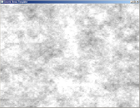

For every iteration we take smaller and smaller gradients. These are stored in an array of max size 20, then combined using two variables: persistence and amplitude. You can take a class on signal processing and probably understand more about this stuff than myself. The general idea though is that every layer of noise is combined with the other layers, and every time we are applying the noise at a slightly greater or lower percentage. Where do the values come from? I wrote a small program that allows me to input those into the fragment shader at will. Good values for them are: amplitude = 0.4, persistence = 0.85, octaveCount = 9.

From here it's up to you to improve the noise. Things that you can do include computing multiple noises and merging them, filtering out some values, or maybe combing some other noise function with the perlin noise. Oh, also, don't use this in a real time application. There are faster algorithms.

Happy hacking!

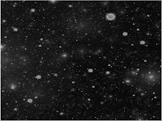
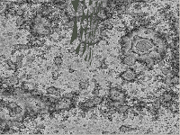


