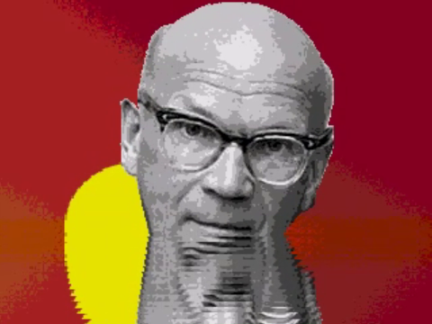
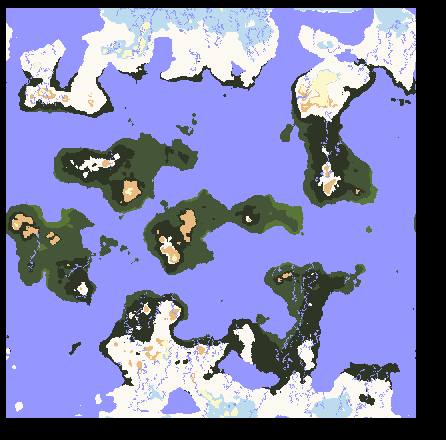
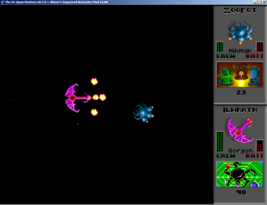
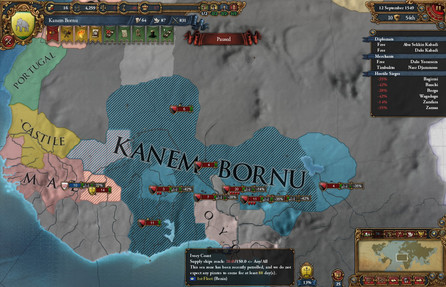

# Who am I

My name is Jesse Kaukonen. I'm a programmer and computer enthusiast located in Espoo, Finland. I've been interested in computers and video games since my early childhood when I had an Amiga 500, which I still have in working order on my desk. My interests lay mainly in parallel computing, 3D and graphics programming, hardware programming, video games and procedural generation. I'm not interested in web development / mobile phones if I can avoid it. I prefer programming in C, C++ and Python.

## Professional

### Delicode Ltd
#### Software developer (2014 - present)

<iframe width="500" height="300" src="https://www.youtube.com/embed/A-6XqqYWzU8" frameborder="0" allowfullscreen></iframe>

I'm employed at [Delicode](https://www.delicode.com/) as a software developer. My work is mostly focused around infrared depth cameras, embedded devices, USB devices, computer vision, servers and customer service. I'm also the janitor for our office and ranked 3rd in our office frisbee golf ratings.

[Delicode Signals](https://signals.delicode.com) is a people counting & analytics solution using infrared depth cameras.

[NI mate](https://ni-mate.com) is a program that communicates with USB depth sensors and processes their depth images into usable data. Examples of data that NI mate computes are skeleton joints from detected users, user location information, and floor planes. NI mate is used for interactive adverts, motion capture, education, and art installations.

[Z-Vector](https://z-vector.com) is a real-time VJ visualization tool that creates a 3D point-cloud based visualizations out of the captured depth + color feed using an infrared camera. Z-Vector has been used for several music videos, such as [Kebu - Deep Blue](https://www.youtube.com/watch?v=A-6XqqYWzU8) and [Phantom - Scars](https://www.youtube.com/watch?v=HFpou6izBQg).

### Tmi Jesse Kaukonen
#### Entrepreneur (2010-2017)

I ran my own business for several years, doing a few odd jobs here and there. This was mostly for some secondary income. I mostly did programming, consulting and 3D modelling.

### Renderfarm.fi
#### Distributed volunteer rendering (2010-2014)

<iframe width="500" height="300" src="https://www.youtube.com/embed/4VUWrZRCtI8" frameborder="0" allowfullscreen></iframe>

During / after my intership at Turku Polytechnic I worked at a project called renderfarm.fi that utilized [BURP](http://burp.renderfarming.net/development/v2_files/) (Big and Ugly Rendering Project) for distributed volunteer rendering with [Blender](https://www.blender.org/) and [BOINC](https://boinc.berkeley.edu/) (Berkeley Open Infrastructure for Network Computing). This was my first real programming job and I learned a ton. Unfortunately the project wasn't viable as a business and ultimately went defunct.

At renderfarm.fi I did coding, design, testing, customer support and server & database maintenance.

## Personal

### Derpling Uploader
#### Starcraft 2 replay uploader

This is a tool I wrote to automatically upload Starcraft 2 replay files to sc2replaystats.com. They offer their own tool to perform the same task, but it's a closed source executable binary that requires admin privileges. I didn't feel like installing it on my computer, so I wrote my own auditable version instead.

[Github link](https://github.com/SirDifferential/derpling_uploader)

#### Sonic 1 romhack

We created a Sonic 1 romhack for a friend's bachelor party. You can read about it in [this](https://jessekaukonen.net/blog_romhack.html) blog entry.

### PTSD
#### Sega Megadrive demo

Our demo group, [PTS](http://www.pouet.net/groups.php?which=13815), released our first demo for the [Simulaatio 2018](http://www.pouet.net/party.php?which=1099&when=2018) demo party. This demo was the first time any of us worked with this hardware. Our expectations were largely limited to getting anything at all done and released, a goal we achieved after some party coding to wrap things up. As someone else put it, "It's not quite [Titan](http://www.pouet.net/prod.php?which=61724) yet, but that's the next one, right?"

* [Pouet link](http://www.pouet.net/prod.php?which=76304)
* [Source code](https://bitbucket.org/ptsdemos/segademo)
* [Detailed blog entry](https://jessekaukonen.net/blog_ptsd.html)

### Proceduralis
#### OpenCL based procedural world generator

Ever since I played Dwarf Fortress I've been fascinated by procedural world generation. I had studied the basic tools used by such games, but never truly implemented them in practise. As I got into studying some OpenCL I suddenly figured it would be fun to create a world using the GPU's immense computational power. You can read more about this project in the relevant [blog entry](./blog_proceduralis.html).

[Github link](https://github.com/SirDifferential/proceduralis)

### Shiver's Balance Mod
#### Star Control 2 online play improvement

Originally and mainly created by the fellow going by the username Shiver, the Balance Mod balances the very broken multiplayer supermelee of Star Control 2. The mod has been a work of love by Shiver, and to lesser part by myself and a few other people. I was mostly involved in testing early on, but performed some development and maintaining tasks later on.

[Github link](https://github.com/uqm-arena/balance-mod)

### Global Tech
#### Europa Univeralis 4 modification

A product of one day during which I wondered how EU4 would work if every nation in the game used western tech. After a spell of scripting the results were so fun I decided to publish the mod.

[Steam workshop link](https://steamcommunity.com/sharedfiles/filedetails/?id=258318354&searchtext=global+tech)

### Python MIDI
#### Synthesizer-to-python Star Control 2

<iframe width="500" height="300" src="https://www.youtube.com/embed/aRz1xe9Kff8" frameborder="0" allowfullscreen></iframe>

Right, maybe I might have been slightly tired when I did this.

[Github link](https://github.com/SirDifferential/instrument_controller)

### batchrender.py
#### Sequential rendering plugin for Blender

Someone on IRC complained that Blender didn't have a tool for setting up sequential render tasks that the computer would automatically execute in a queue. As the Blender's Python API is pretty clear it didn't take long for me to write such a tool.

[Github link](https://github.com/SirDifferential/batch_render)

### Website
#### You're reading it

I don't like web app development. I don't like Javascript, PHP or nodejs. I don't like websites that hog up hundreds of megs of memory and peg the CPUs on older computers to 100%. As such, my website is made entirely out of markdown turned into HTML with minimal amounts of extra junk, always served as static files, using the Github markdown style. The pages are created using a bash script and some Python. To this day I haven't found any problems with this system.

[Github link](https://github.com/sirdifferential/website)

### Story of a Lost Sky
#### Touhou fangame RPG

I ran into a Touhou fan project I liked, found a couple of bugs and ended up doing dedicated testing for a while.

[Main site](http://featheredmelody.com/index.html)

### Free software contributions

Here's some projects for which I've made contributions:

* [libfreenect2](https://github.com/openkinect/libfreenect2)
* [Orbbec Astra SDK](https://github.com/orbbec/astra)

### KAAL
#### Short film

<iframe width="500" height="300" src="https://www.youtube.com/embed/uqbVLlJjku8" frameborder="0" allowfullscreen></iframe>

We created a short film for the Kill All Audio and Lights competition at Assembly 2009. The idea was to make a very loud and visual film that would be shown on the screen when the audience was to shut their audio systems and displays. The project included three graphics artists and one musician, with me mostly responsible for the landscape and props, as well as animation.

### Haba-ipa
#### Beer brewing documentary

<iframe width="500" height="300" src="https://www.youtube.com/embed/kvvKGE30-6k" frameborder="0" allowfullscreen></iframe>

Olutkulttuuriseura, a beer association in Finland, organized a beer brewing competition for the annual party in 2017. The members in the Helsinki region got together to brew a beer together. As part of this I filmed a documentary about how the beer was made. This video was targeted mainly at people interested in beer while also serving as a publicity stunt to broaden the understanding about beer culture.

The filming was done using one Sony handheld camcorder that had a really low quality mic and some exposure problems. The audio had some noise in it that I didn't bother fixing.

Special thanks to the brewing meister for allowing to film this as well as offering critique on the footage. The assorted members of Olutkulttuuriseura also assisted. Kristian Kristola, Mika Saari and RantingHuman offered me critique.

[Detailed blog entry](https://jessekaukonen.net/blog_habaipa.html)

